推荐几位复习期间邂逅的神仙博主！
github:Sophia-11
博客园：RogZ 

# ch1

> 记录基本概念和课本上的一些约定。

- data set ; instance = sample ; attribute = feature = feature vector; attribute value ; attribute space = sample space = 输入空间 ;
- 每个示例由d个特征描述称d为样本的“维数”
- label:关于示例结果的信息，拥有标记信息的示例叫样例
- 所有标记的集合成为输出空间
- 预测的是离散值——分类 ； 预测的是连续值——回归
- 学得模型后，试用其进行预测的过程称为“测试”，被预测样本叫测试样本
- 根据训练数据是否拥有标记信息，学习任务大致分为监督学习（supervised learning )和无监督学习
- 分类、回归——监督学习 ； 聚类——无监督学习
- 泛化：学得模型适用于新样本的能力。
- 假设空间

  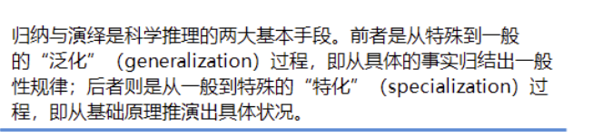
- 归纳偏好
- 奥卡姆剃刀
- 主要符号表
  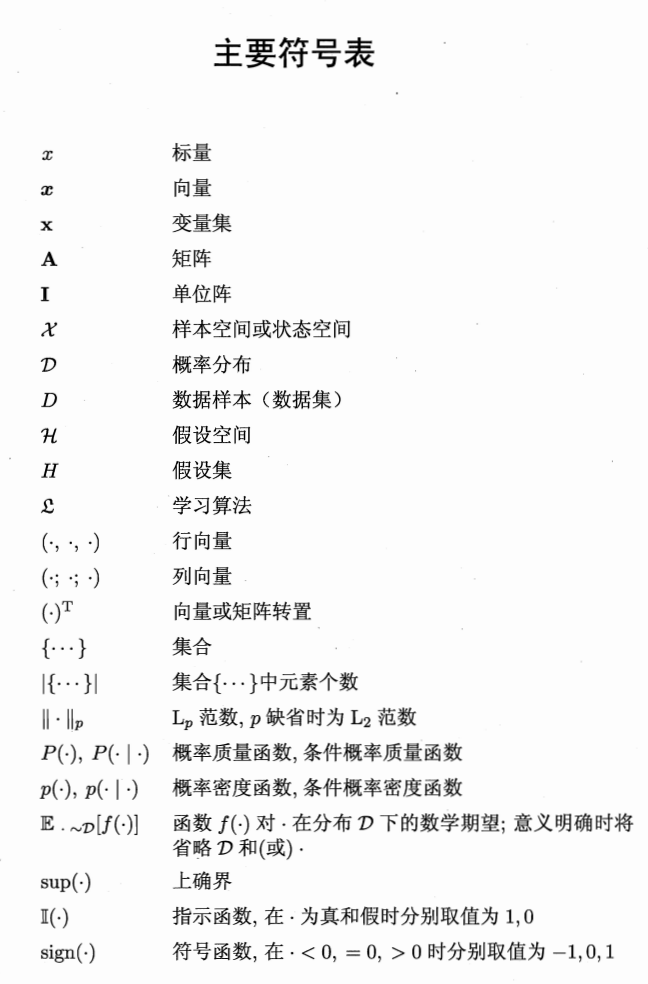
- 各种空间小总结

  - 样本空间 ：所有可能的输入和输出的集合。
  - **假设空间** ：模型可以选择的所有可能的函数集合。
  - 参数空间 ：模型参数的所有可能取值的集合。
  - 特征空间 ：输入数据经过特征提取后的空间。
  - 输出空间 ：模型预测的所有可能结果的集合。
  - **决策空间** ：模型在训练或推理过程中做出的所有可能决策的集合。
  - **版本空间** ：有多个假设与训练集一致，即存在着一个与训练集一致的“假设空间”，将之称为版本空间。

## 如何生成假设空间和版本空间？

### 假设空间

包含：
（1）每一个属性的所有取值分别组合形成所有可能性结果
（2）属性取值至少含一个为“无论去什么值都合适”（即属性值为通配符“*”）的结果集合
（3）所有属性值都无法取到的结果，即为空集，一个假设空间有且仅有一个
故而，若数据集有n个特征，每个特征对应取值为$a_i$,则可得到假设空间规模：
($a_i$所加的“1”是通配符，最后的“1”是空集)

$$
\begin{align*}
& (\prod_{i=1}^na_i)  \\
+&(\prod_{i=1}^n(a_i+1))-(\prod_{i=1}^na_i)\\
+&1
\end{align*}
$$

总结公式是：

$$
\biggl[\prod_{i=1}^{n} (a_i+1)\biggl]+1
$$

### 版本空间

- 由假设空间不断删除与整理不一致的假设和与反例一致的假设。——包含“**与正例一致的假设和与反例不一致的假设**”
- 它可以看成是对正例的最大泛化
- NFL定理

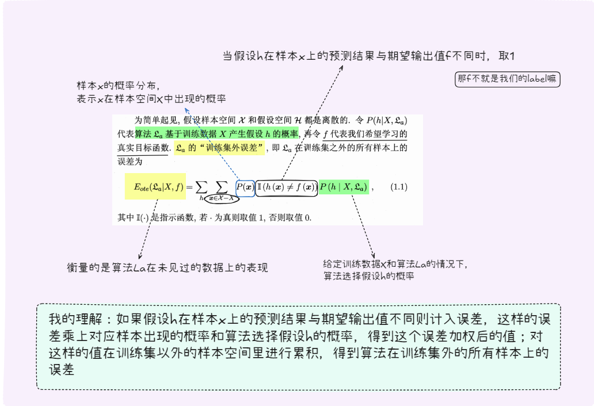

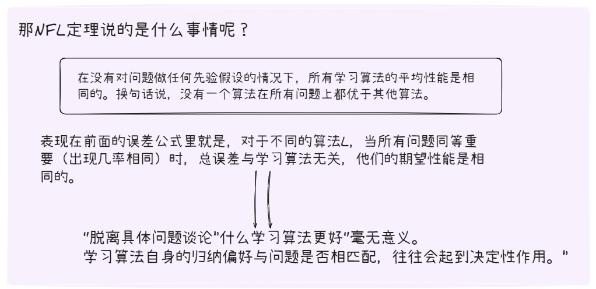

# ch2

> 模型评估与选择

## 基础概念

- 错误率
- 精度
- 误差——训练/泛化误差
- 过拟合与欠拟合

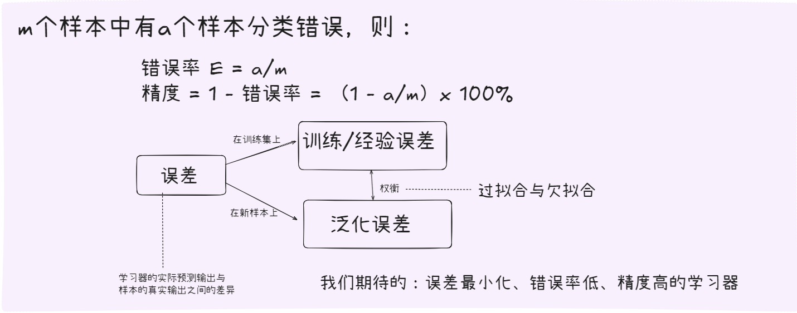{width="110%" height="120%"}

- 一般把测试集上的测试误差作为泛化误差的近似
- 测试样本：从样本真实分布中独立同分布采样得到，应与训练集尽量互斥

> 由于数据集局限，我们需要对数据集D适当处理产生更优质的训练集S和测试集T

## 数据集划分方法

- 留出法，自助法，交叉验证法

### 留出法

直接划分D为互斥的S和T，$D=S \cup T，S \cap T=\emptyset$ ， S上训练，T上评估

Tip : S和T划分尽量与数据分布一致。

- **分层采样**：保留类别比例的采样方式
- 若S 、T 中样本类别比例差别很大，则误差估计将由于训练/测试数据分布的差异而产生偏差.
- 即便给定S/T的样本比例，仍存在多种划分方式对D进行分割，不同的划分将导致不同的训练/测试集，相应的，模型评估的结果也会有差别

> （如果恰好S中全是正例，T中全是反例，将会全部预测错误）。

在使用留出法时，一般要采用**若干次随机划分、重复进行实验评估后取平均值**作为留出法的评估结果.
例如进行100次随机划分,每次产生一个训练/测试集用于实验评估，100次后就得到100个结果，而留出法返回的则是这100个结果的平均。

### 自助法

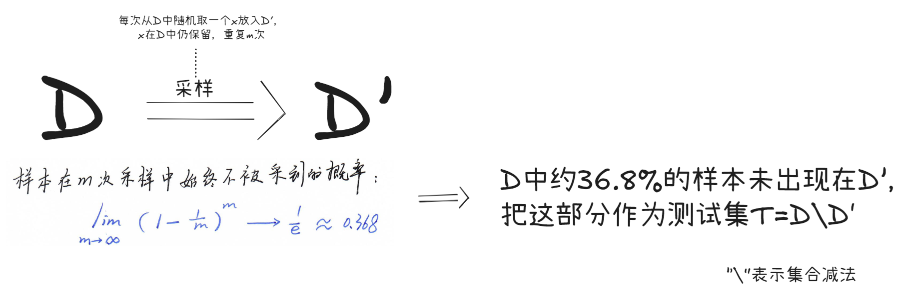
优点：在数据集较小、难以有效划分训练/测试集时很有用，能从初始数据集中产生多个不同的训练集,这对集成学习等方法有很大的好处。
缺点：所产生数据集改变了初始数据集的分布，这会引入估计偏差。

### 交叉验证法

1、$D = D_1 \cup D_2 \cup ... \cup D_k , D_i \cap D_j = \emptyset (i \neq j)$
每个$D_i$都尽可能保持数据分布的一致性，即从D中通过分层采样得到
2、每次用 `k - 1` 个子集的并集作为训练集，余下的那个子集作为测试集
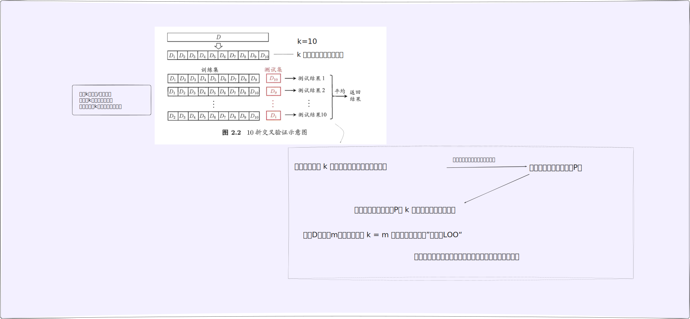

## 性能度量

> 衡量model泛化能力的评价标准，反映任务需求
> $y_i$是$x_i$的真实标记（label），要评估学习器f的性能，要用预测结果f(x)与label `y`比较

- 均方误差
- 错误率与精度
  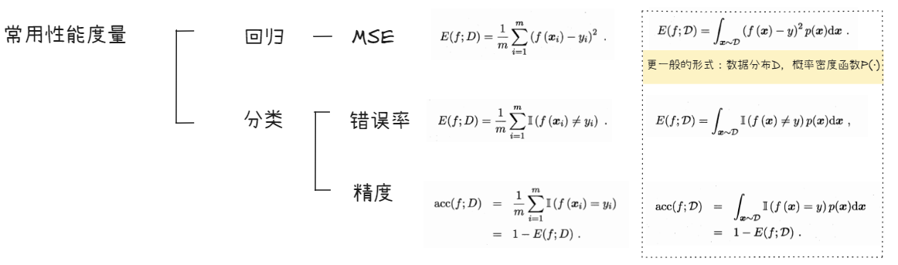
- 查准率P、查全率R、F1、ROC与AUC
- 代价敏感错误率与代价曲线

### 查准率、查全率、F1

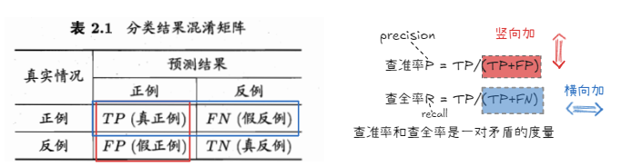

- 查准率：检测出来的信息有多少比例是用户感兴趣的（准不准）
- 查全率：检索出多少用户感兴趣的信息（全不全）
- 想要查的准，条件往往比较苛刻，难免会漏掉一些好的；若想要查的全，条件就相对宽松，也会混入一些差的。

#### P-R曲线

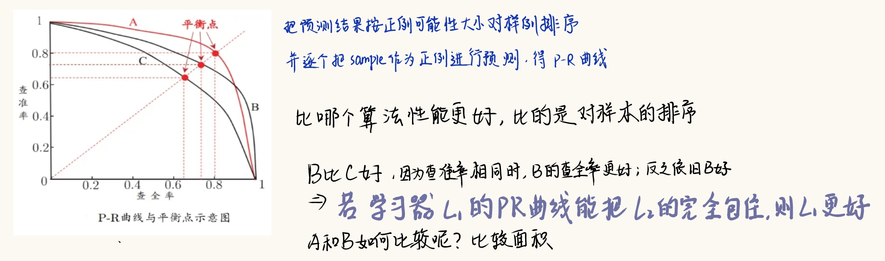

- f1的PR曲线被f2包住，则认为f2性能更优
- 若难说谁被谁包住，比较曲线与横轴所围面积，面积大者性能更优
- 面积难以估算，于是设计了“**平衡点BEP**”来度量,具体为：作y = x，比较f1、f2与 y = x 的交点取值，大者性能优。

#### *F1度量*

> BEP太简单了，F1是其更一般的形式

- 先介绍一下调和平均：
  - 调和平均是统计学里的一种平均数，其计算方法是将数据的个数除以所有数据的倒数之和。比如，对于一组正数（x1,x2,...,xn），调和平均数H计算公式为：

  $$
  H = \frac{n}{\frac{1}{x_1}+...+\frac{1}{x_n}}
  $$

  n是数据的个数。

F1是基于P和R的**调和平均**定义的：

$$
\frac{1}{F1} = \frac{1}{2} \dot (\frac{1}{P}+\frac{1}{R})
$$

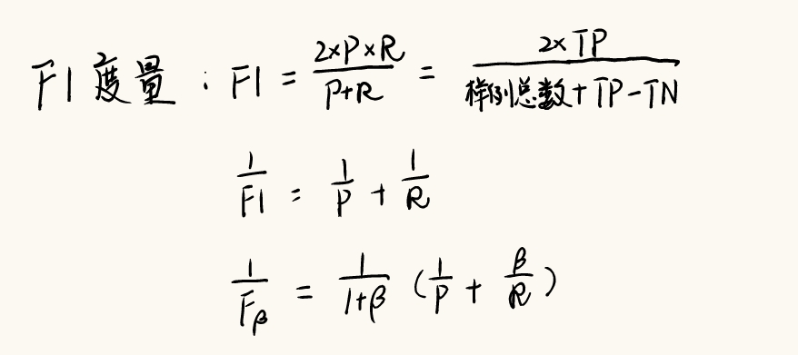
$F_{\beta}$是加权调和平均(F1的更一般形式)：

$$
\frac{1}{F_{\beta}} = \frac{1}{1+\beta^2} \dot (\frac{1}{P}+\frac{\beta^2}R)
$$

$F_{\beta}$ 能让我们表达对P和R的不同偏好：
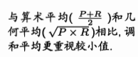

- $\beta > 0$ ——  查全率对查准率有相对重要性
- $\beta = 1$ ——  F1
- $\beta > 1$ ——  查全率R有更大影响
- $\beta < 1$ ——  查准率P有更大影响

#### 如何处理多次训练/测试得到的多个二分类混淆矩阵

生成n个二分类混淆矩阵（多次训练/测试；多分类任务中两两类别的组合对应一个混淆矩阵），计算各自P和R：（P1，R1）,...(Pn,Rn),计算平均值，或者先平均再计算。
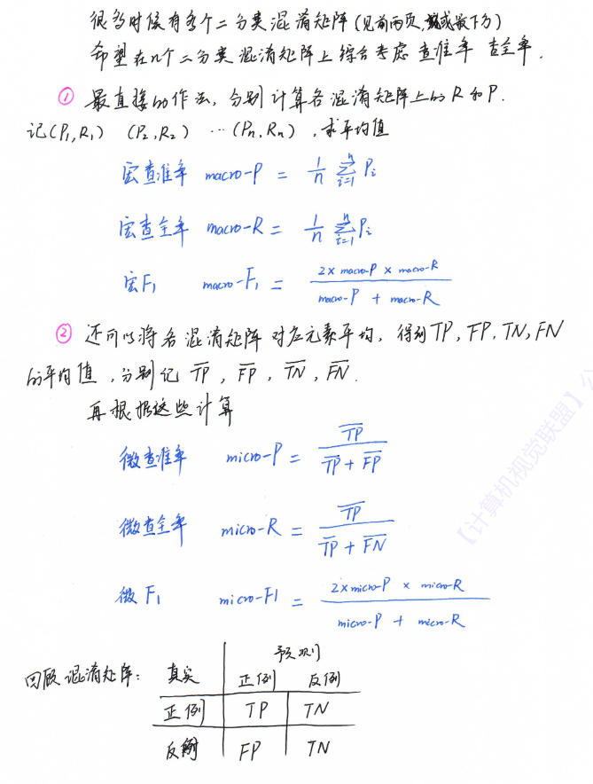

### ROC和AUC

- 分类阈值：学习器为测试样本产生一个实值或概率预测，然后将这个预测值与一个“分类阈值”进行比较，大于阈值的、小于阈值的分别划分为一类。
- 截断点：根据实值或概率预测结果将测试样本排序，分类过程相当于在这个排序中以某个“截断点”将样本分为两部分。
- ROC：Receiver Operating Characteristic，受试者工作特征。

  - 纵轴为“真正例率”（TPR，True Positive Rate），横轴为“假正例率”（FPR，False Positive Rate）。
  - 先将正例反例放在一起，按照预测结果进行排序，从（0，0）出发，依次按照序列向后读，如果是正例，则按y轴正方向向上移动$\frac{1}{m}$个单位，若为反例，则按x轴正方向向左移动$\frac{1}{n}$个单位，直到序列遍历结束。
- AUC：Area Under ROC Curve，ROC曲线下的面积。（其实就是各点之间形成的矩形面积求和）。

  - AUC值越大的分类器，性能越好。

  $$
  AUC=\frac{1}{2}\sum_{i=1}^{m-1}(x_{i+1}-x_i)\times(y_i+y_{i+1})
  $$

  - AUC 考虑的是样本预测的排序质量，因此它与排序误差有紧密联系
- 排序“损失”（loss）：ROC曲线之上的面积，也就是1-AUC。

  - 给定$m^+$个正例和$m^-$个反例，零$D^+和D^-$分别表示正反例集合，则排序损失表示为：

  $$
  \mathcal(l) = \frac{1}{m^+m^-}\sum_{x^+ \in D^+}\sum_{x^-\in D^-} \frac{1}{2}(\mathbb{I}(f(x^+)<f(x^-))+(\mathbb{I}(f(x^+)=f(x^-)))
  $$

  若正例的预测值比反例小，则罚1分，若正例预测值和反例预测值相等则罚0.5分
  理解性：
  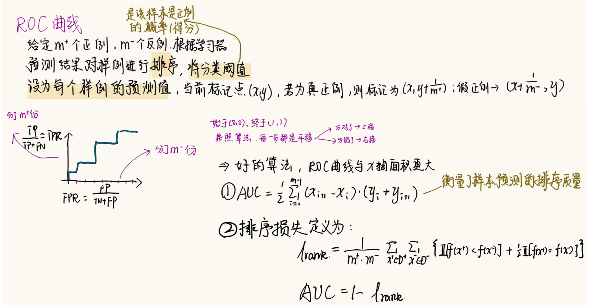
  与课本内容更贴的笔记：
  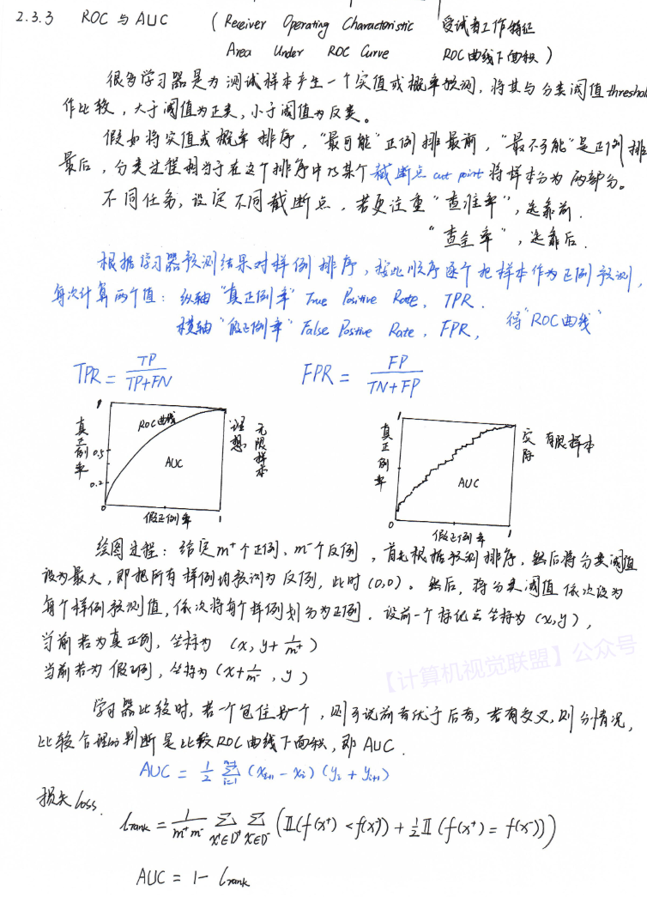

### 代价敏感错误率

前面的错误代价其实都默认了均等代价，但实际中不同错误代价应该不同，所以又有了“代价敏感”的错误率：

$$
\begin{align*}
E(f;D;cost) = \frac{1}{m} \Biggl( \sum_{x_i\in D^+} \mathbb{I}\biggl[f(x_i) \neq y_i\biggl] \times cost_{01} +  \\
 \sum_{x_i\in D^-} \mathbb{I}\biggl[f(x_i) \neq y_i\biggl] \times cost_{10}    \Biggl)
 \end{align*}
$$
- TPR：真正例率
- FPR：假正例率
- FNR：假反例率
- TNR：真反例率
- ROC：y(真正例率)-x(假正例率)曲线
### 代价曲线
#### 如何绘制？
ROC上每一点（FPR,TPR）对应代价平面上一条线段。
- FNR = 1-TPR
- 绘制从（0，FPR）到（1，FNR）的线段，线段下的面积表示该条件下的期望的总体代价，如此将ROC每个点都转化为代价平面上的一条线段
- 取所有线段的下界，其所围成的面积就是所有条件下学习器的期望总体代价
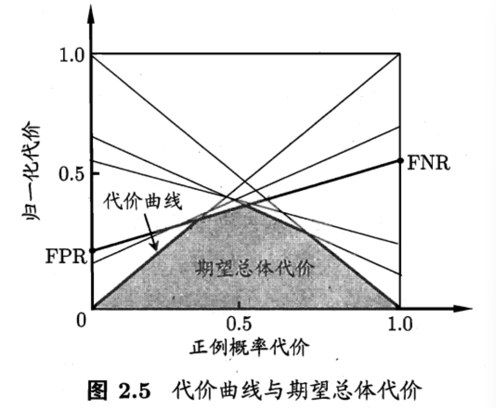
代价曲线原理：（这里就直接搬运了哈）
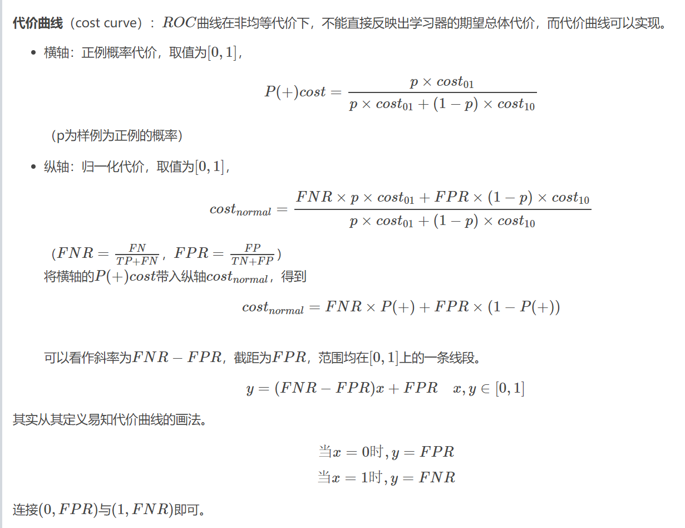{width="200%" height="150%"}
-  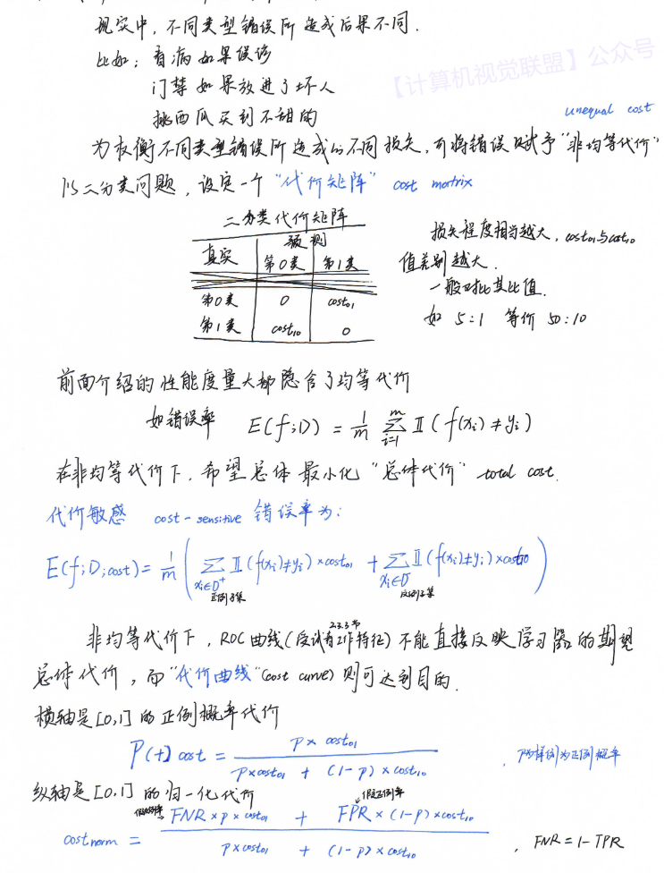

## 比较检验
>为什么机器学习中性能比较非常复杂?两个学习器不能直接比吗？
>>第一、我们希望比较泛化性能，然而实验评估获得的是测试集性能，两者对比结果未必相同。
>>第二、测试集上的性能与测试集本身选择有很大关系。测试集大小，或测试集大小一致但样例差异也会导致不同结果。
>>第三、很多算法本身有一定的随机性，即使相同参数设置同一个测试集多次运行，结果可能有所不同。

>统计假设检验为我们进行学习其比较提供了重要依据。
### 假设检验
假设检验做了什么？根据测试错误率估推泛化错误率的分布。即对学习器泛化错误率分布的某种判断或猜想，例如“$\epsilon = \epsilon_0$”
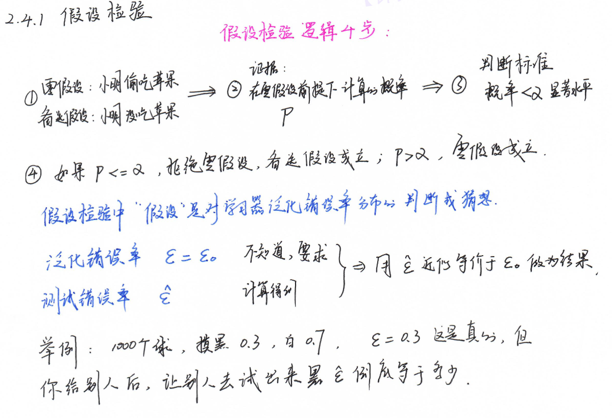
- 泛化错误率ϵ：学习器在一个样本上犯错的概率
- 测试错误率$\hat\epsilon$：m个测试样本有$\hat\epsilon \times m$个被错误分类
(可以把它们视为概率论里的随机事件)
- 假设测试样本是从样本总体分布中独立采样得到的，则泛化错误率=ϵ的学习器在m个样本中的m'个样本误分类的概率就为$\epsilon^{m'}(1-\epsilon)^{m=m'}$

那么，有了以上的铺垫，综合概率论中二项分布的知识，(因为假设了“测试样本是从样本总体分布中独立采样而得”)，我们发现可以用二项分布来描述“在 m 个测试样本中，恰好有$\hat\epsilon \times m$个被误分类的概率”,就有了课本上的公式：
（**这里之所以可以这样估计**，是因为$\epsilon$是$\hat\epsilon$的无偏估计，可以用期望去证，也是概率论与数理统计的知识）
$$
P(\hat\epsilon;\epsilon)=C_{m}^{\hat\epsilon \times m} \epsilon^{\hat\epsilon \times m}(1-\epsilon)^{m-\hat\epsilon \times m}
$$
P在$\epsilon = \hat\epsilon$时最大（回忆二项分布的图像）
### 用二项检验对假设进行检验
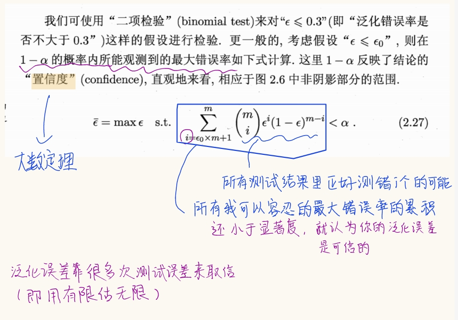
搬运：
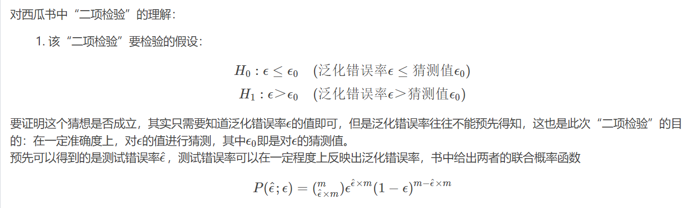
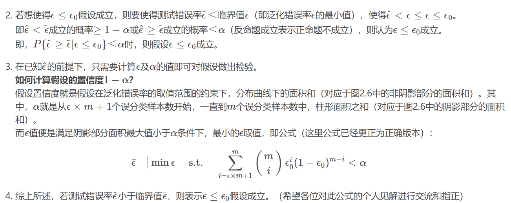
### t检验
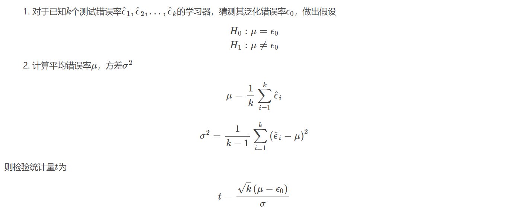
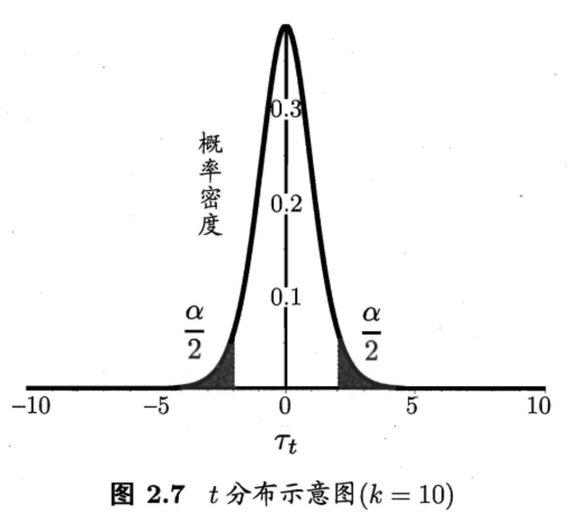
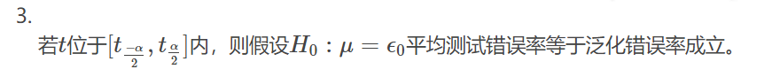

### 交叉t检验
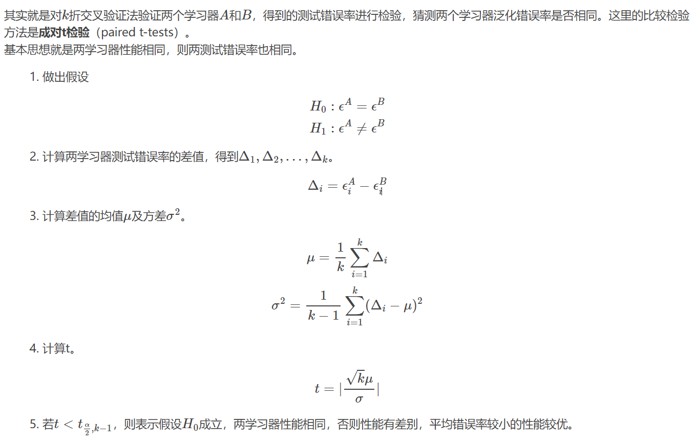
举例计算：
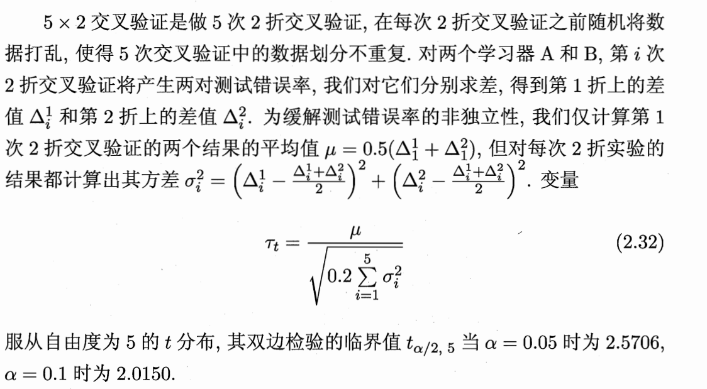
### McNemar检验（二分类使用留出法）
>实现对于二分类多个学习器之间性能的检验。
（概率论还没复习完的大三菜鸟决定先屈服去记公式)
（搬运）
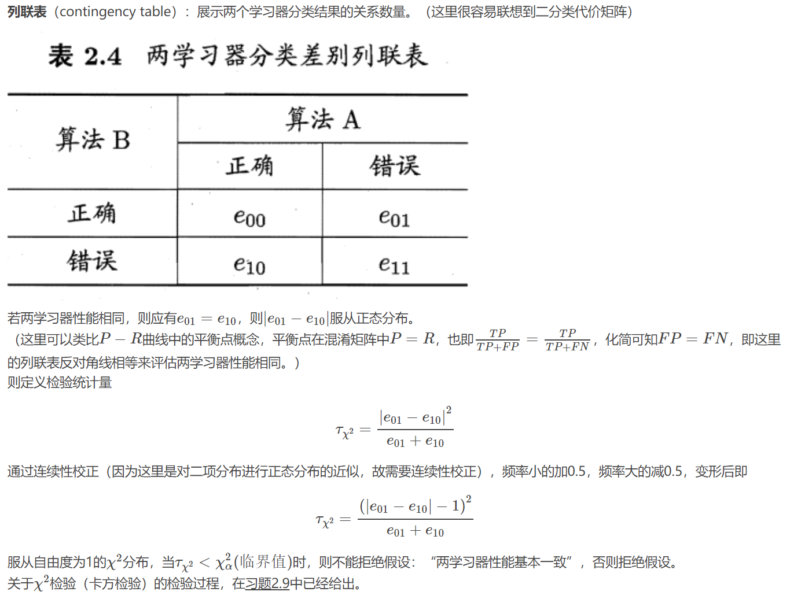
### Friedman检验与 Nemenyi后续检验（没整理因为看不懂）
>......放过我叭概率论~ 出来混迟早是要还的er~ （先浅浅逃避一下咱们后边要搞懂嗷~ ）《论如何哄着自己学习》
>passion! passion! passion! pasion!

## 偏差与方差
>解释“学习算法为什么具有这样的泛化性能”的工具。偏差一方差分解试图对学习算法的期望泛化错误率进行拆解。

基本约定：
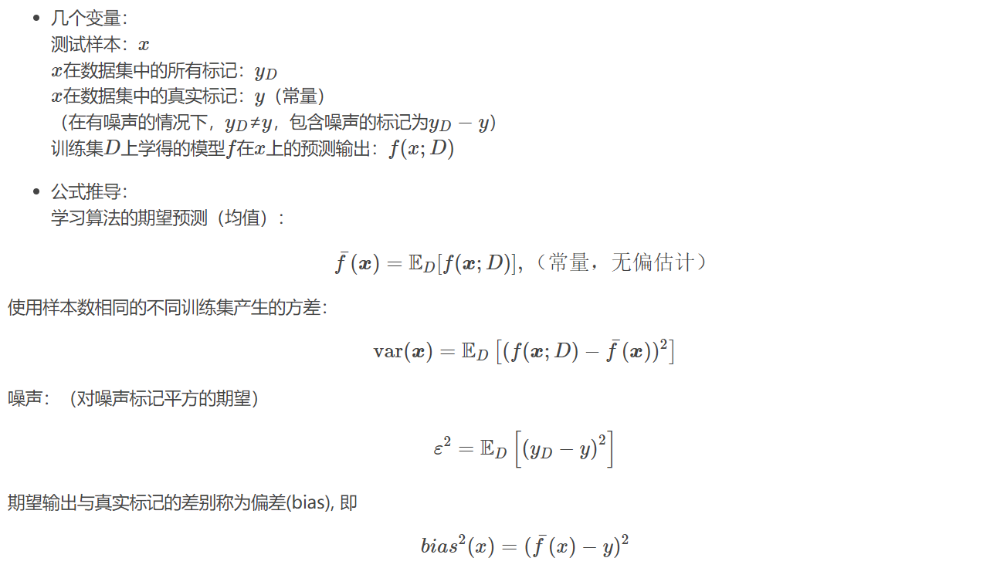
对算法的期望泛化误差进行分解的公式：
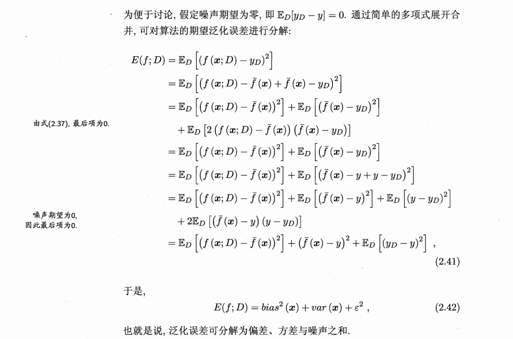
具体推导见[南瓜书](https://datawhalechina.github.io/pumpkin-book/#/chapter2/chapter2?id=_25-%e5%81%8f%e5%b7%ae%e4%b8%8e%e6%96%b9%e5%b7%ae)（可能需要科学上网，运气好可能也不需要，网上也有其他搬运）
最终有：
$$E(f;D)=bias^2(x)+var(x)+ε^2$$

= 泛化错误率/泛化误差 = 偏差（学习算法能力） + 方差（数据的充分性） + 噪声（问题本身难度）
- 偏差：度量了学习算法期望预测与真实结果的偏离程度，刻画了学习算法本身的拟合能力（偏差越大，拟合能力越差）；
- 方差：度量了同样大小的训练集的变动所导致的学习性能的变化，即刻画了数据扰动所造成的影响（方差越大，数据的变动影响越大）；
- 噪声：表达了在当前任务上任何学习算法所能达到的期望泛化误差的下界，即刻画了学习问题本身的难度（噪声越大，问题越难）。

### 偏差-方差窘境
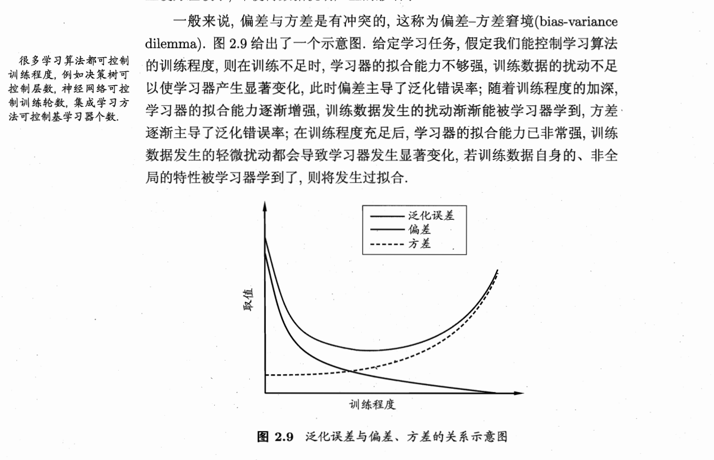